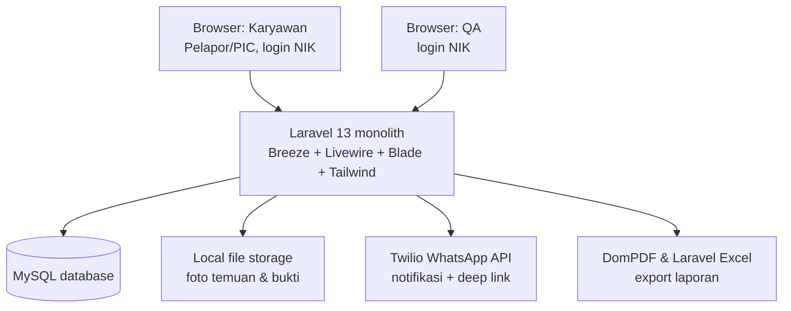
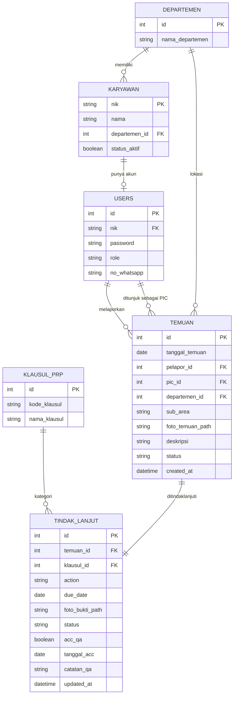
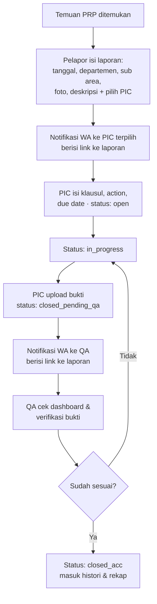
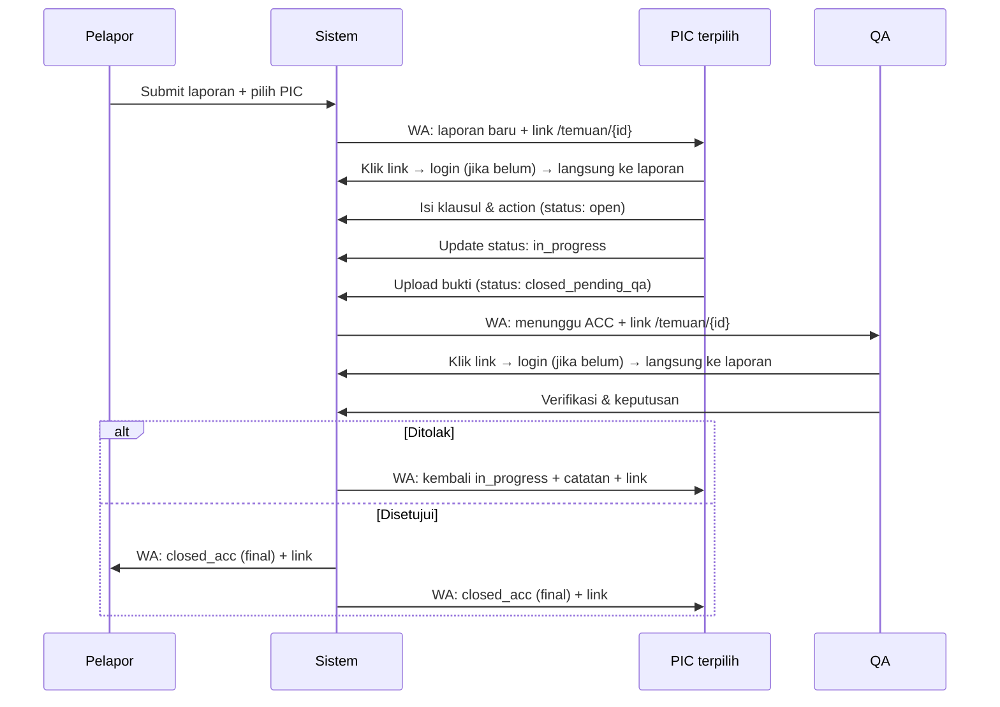

 Implementation plan — sistem verifikasi PRP plant

Dokumen ini adalah acuan pengembangan (development blueprint) untuk sistem verifikasi PRP (Prerequisite Program) berbasis web, menggantikan proses Google Form manual yang selama ini digunakan. Dokumen mencakup arsitektur, model data, alur kerja, spesifikasi rute/komponen, hingga rencana kerja harian.

**Stack teknologi final:** Laravel 13 + Breeze (autentikasi) + Livewire (reaktivitas) + Tailwind CSS (styling) + MySQL (database) + local filesystem (penyimpanan foto) + Twilio PHP SDK (notifikasi WhatsApp) + barryvdh/laravel-dompdf (export laporan PDF). Akses sistem dibatasi hanya untuk karyawan pabrik yang NIK-nya sudah terdaftar di master data — tidak ada pendaftaran publik.

---

## 1. Ringkasan proyek

| | |
|---|---|
| Nama sistem | Sistem verifikasi PRP plant |
| Tujuan | Digitalisasi pelaporan, tindak lanjut, dan verifikasi ketidaksesuaian PRP di plant |
| Pengganti proses | Google Form + rekap manual |
| Pengguna | Karyawan pabrik terdaftar (berperan sebagai Pelapor, dan bisa ditunjuk sebagai PIC untuk temuan tertentu), serta QA |
| Platform | Aplikasi web (monolith Laravel + Livewire), diakses via browser desktop & HP |
| Akses | Tertutup — hanya bisa login memakai NIK yang sudah terdaftar di master data karyawan |

**Masalah yang diselesaikan:** laporan yang tersebar di spreadsheet Gform tanpa status yang jelas, tidak ada notifikasi otomatis ke penanggung jawab, tidak ada verifikasi berjenjang sebelum temuan dianggap selesai, rekap/analisis data yang harus dikerjakan manual, dan tidak adanya kontrol akses (siapa saja bisa mengisi Gform tanpa verifikasi identitas).

---

## 2. Ruang lingkup

**Termasuk (v1):**
- Form pelaporan temuan, termasuk **penunjukan PIC** oleh Pelapor saat laporan dibuat
- Satu akun bisa **beralih tampilan** antara Pelapor dan PIC (PIC bukan role tetap, tapi kapasitas dinamis per-temuan)
- Form tindak lanjut & perubahan status oleh PIC yang ditunjuk
- Dashboard, grafik, rekap periode, export data (Excel & PDF), dan konfirmasi ACC oleh QA
- Notifikasi WhatsApp (Twilio) berisi **link langsung ke laporan terkait**, dengan redirect otomatis ke laporan tersebut setelah login
- Login berbasis NIK — hanya karyawan terdaftar yang bisa memiliki akun
- Role-based access control (`karyawan`, `qa` — QA merangkap sebagai admin master)

**Belum termasuk (dipertimbangkan untuk fase lanjutan):**
- Aplikasi mobile native (v1 cukup responsive web)
- Integrasi ke sistem ERP/QMS pabrik
- E-signature untuk approval QA
- Reminder otomatis mendekati due date
- Reassignment PIC (memindahkan penunjukan PIC ke orang lain jika PIC awal tidak merespons)

---

## 3. Peran & hak akses

Sistem ini hanya mengenal **2 role akun**: `karyawan` dan `qa`. Tidak ada role `pelapor` atau `pic` yang melekat permanen ke akun — keduanya adalah **kapasitas/tampilan dinamis** yang bisa dimiliki bersamaan oleh seorang karyawan.

| Role akun | Kapasitas | Bisa melakukan |
|---|---|---|
| `karyawan` | Tampilan **Pelapor** (selalu aktif) | Membuat laporan temuan baru, menunjuk siapa yang jadi PIC untuk laporan itu, melihat status laporan miliknya sendiri |
| `karyawan` | Tampilan **PIC** (aktif kalau ditunjuk) | Melihat daftar temuan di mana dirinya ditunjuk sebagai PIC, mengisi tindak lanjut, mengubah status, upload bukti |
| `qa` | Dashboard QA (admin master) | Melihat seluruh laporan & dashboard, ACC/reject, rekap, export data, kelola master data & akun pengguna |

**Bagaimana seseorang jadi PIC:** saat membuat laporan, Pelapor memilih siapa yang bertanggung jawab menindaklanjuti (field "PIC ditunjuk", dropdown dari karyawan yang **sudah punya akun sistem**). Begitu dipilih, laporan itu otomatis muncul di **Tampilan PIC** milik orang tersebut — cukup lewat relasi `pic_id` di tabel `temuan`, tanpa perlu role terpisah atau akun kedua.

**Switch tampilan:** setelah login, akun `karyawan` mendarat di **Tampilan Pelapor** (default). Kalau ada minimal satu temuan dengan `pic_id` miliknya yang statusnya belum `closed_acc`, muncul tab/badge **Tampilan PIC** yang bisa diklik untuk berpindah — satu akun, dua tampilan, tanpa logout atau ganti akun. Akun `qa` tidak melalui switch ini, langsung ke dashboard QA miliknya sendiri.

**Kontrol akses berbasis NIK:** pendaftaran akun **tidak terbuka untuk publik**. QA (selaku admin master) membuat akun baru dengan memilih NIK dari master data karyawan (`karyawan`) yang statusnya aktif — jika NIK tidak ada/tidak aktif di master data, akun tidak bisa dibuat. Login memakai NIK + password (bukan email).

---

## 4. Arsitektur sistem

| Layer | Teknologi | Catatan |
|---|---|---|
| Backend framework | Laravel 13 (PHP 8.3+) | Monolith MVC, mengurus routing, business logic, dan rendering view |
| Autentikasi | Laravel Breeze, dikustom memakai kolom `nik` sebagai username | Registrasi publik dinonaktifkan; akun dibuat oleh QA (admin master) |
| Reaktivitas UI | Livewire 3 | Form dinamis, switch tampilan Pelapor/PIC, upload foto, filter dashboard — tanpa API/SPA terpisah |
| Styling | Tailwind CSS | Bawaan starter kit Breeze, dikustom sesuai identitas pabrik |
| Database | MySQL 8 | Relasional, cocok untuk data terstruktur & laporan |
| Penyimpanan foto | Laravel filesystem (local disk, `storage/app/public`) | Foto temuan & foto bukti, diakses via symlink `php artisan storage:link` |
| Notifikasi | Twilio PHP SDK (WhatsApp Business API) | Dikirim lewat Laravel Queue, pesan berisi deep link ke laporan terkait |
| Export PDF | barryvdh/laravel-dompdf | Laporan temuan tunggal & rekap periode dalam bentuk PDF |
| Export Excel | maatwebsite/excel (Laravel Excel) | Export data custom range/bulanan/tahunan dalam format xlsx/csv |
| Hosting | Server internal pabrik (on-premise) atau VPS | PHP-FPM + Nginx/Apache, queue worker berjalan sebagai service terpisah |



> Karena memakai Livewire, tidak dibutuhkan lapisan REST API/SPA terpisah untuk fitur utama — interaksi form dan dashboard ditangani langsung oleh komponen Livewire di dalam aplikasi Laravel yang sama (server-rendered, AJAX otomatis dari Livewire).

---

## 5. Model data



**Perubahan penting dari versi sebelumnya:** field `pic_id` sekarang berada di tabel `temuan` (diisi Pelapor saat membuat laporan), bukan lagi di `tindak_lanjut`. `TINDAK_LANJUT` tidak lagi punya `pic_id` sendiri — siapa PIC-nya selalu diambil dari `temuan.pic_id`, supaya tidak ada dua sumber data yang bisa berbeda.

**Batasan penting:** dropdown "PIC ditunjuk" di form Pelapor hanya menampilkan karyawan yang **sudah punya akun** di tabel `users` (bukan seluruh `karyawan`), karena PIC harus bisa login untuk menindaklanjuti. Kalau orang yang dimaksud belum punya akun, QA (admin master) perlu membuatkannya dulu.

**Nilai `role` pada `USERS`:** hanya dua — `karyawan` dan `qa`. Tidak ada nilai `pelapor`/`pic`/`admin` terpisah; keduanya adalah kapasitas dinamis (lihat bagian 3), bukan nilai kolom.

---

## 6. Alur kerja (workflow) & status lifecycle

| Status | Arti | Diset oleh |
|---|---|---|
| `open` | Tindak lanjut baru dibuat, belum ada progres | PIC (otomatis saat isi klausul & action pertama kali) |
| `in_progress` | PIC sedang mengerjakan penyelesaian | PIC |
| `closed_pending_qa` | PIC selesai & upload bukti, menunggu verifikasi | PIC |
| `closed_acc` | QA sudah verifikasi dan menyetujui | QA |

Jika QA menilai bukti belum sesuai, status dikembalikan ke `in_progress` beserta `catatan_qa` berisi alasan penolakan.





---

## 7. Modul & fitur detail

### 7.0 Switch tampilan Pelapor/PIC

Halaman utama (`/beranda`) setelah login menampilkan dua tab untuk akun `karyawan`: **Pelapor** (default) dan **PIC** (muncul badge jumlah temuan yang perlu ditindaklanjuti jika ada). Perpindahan tab murni di sisi tampilan (Livewire), tidak perlu reload halaman penuh maupun logout. Komponen: `Livewire\SwitchTampilan`, membungkus dua komponen anak: `DaftarTemuanPelapor` dan `DaftarTemuanPIC`.

### 7.1 Tampilan Pelapor — form laporan temuan

| Field | Tipe | Wajib | Catatan |
|---|---|---|---|
| Tanggal ditemukan | Date | Ya | Default: hari ini, bisa diubah |
| Nama penemu | Text (auto dari akun login) | Ya | Ambil dari relasi `USERS` → `KARYAWAN` |
| Departemen | Select (master data) | Ya | Dropdown dari tabel `departemen` |
| Sub area | Text | Ya | Deskripsi lokasi lebih detail |
| Foto temuan | Livewire file upload (image) | Ya | Maks. 5MB, format jpg/png, disimpan di `storage/app/public/temuan` |
| Deskripsi temuan | Textarea | Ya | Penjelasan ketidaksesuaian |
| **PIC ditunjuk** | Select (searchable, dari `users` yang aktif) | **Ya** | Pelapor memilih siapa yang bertanggung jawab menindaklanjuti; orang ini otomatis melihat laporan di Tampilan PIC miliknya |

Komponen: `Livewire\FormTemuan`. Setelah submit: sistem membuat record `temuan` (dengan `pic_id` terisi) + record `tindak_lanjut` awal berstatus `open`, lalu meng-queue job pengiriman notifikasi WhatsApp ke `no_whatsapp` milik PIC terpilih, **berisi link langsung ke `/temuan/{id}`**.

### 7.2 Tampilan PIC — tindak lanjut

`Livewire\DaftarTemuanPIC` menampilkan seluruh temuan dengan `pic_id` = user yang sedang login, diurutkan berdasarkan urgensi (mendekati/lewat due date ditandai berbeda).

| Field | Tipe | Wajib | Catatan |
|---|---|---|---|
| Klausul temuan | Select (master data `klausul_prp`) | Ya | Kategori sesuai klausul PRP pabrik |
| Action | Textarea | Ya | Tindakan yang akan/telah dilakukan |
| Due date | Date atau jumlah hari | Ya | Estimasi waktu penyelesaian |
| Foto bukti | Livewire file upload (image) | Ya (sebelum status closed) | Disimpan di `storage/app/public/bukti` |
| Status | Select: open / in_progress / closed | Ya | PIC hanya bisa set sampai `closed_pending_qa`, bukan `closed_acc` |

> Field "Nama PIC" tidak lagi diisi manual — otomatis diambil dari `temuan.pic_id` (identitas orang yang login), karena penunjukan sudah dilakukan Pelapor di awal.

Komponen: `Livewire\TindakLanjutPIC`, dibuka lewat halaman detail `/temuan/{id}` (juga jadi target deep link notifikasi WA). Setiap perubahan status memicu job notifikasi WhatsApp ke QA berisi link ke laporan yang sama.

### 7.3 Dashboard QA — verifikasi & admin master

- **Status semua temuan** — `Livewire\DaftarTemuanQA`, tabel seluruh temuan + status terkini + PIC yang ditunjuk, filter per departemen/status.
- **Grafik per departemen** — bar chart (Chart.js via Livewire) jumlah temuan per departemen.
- **Rekap periode** — filter custom range, bulanan, atau tahunan.
- **Export data** — Excel/CSV (Laravel Excel) dan PDF (DomPDF), memakai filter rentang yang sama dengan rekap.
- **Konfirmasi ACC** — `Livewire\VerifikasiQA`, dibuka lewat `/temuan/{id}` yang sama (link dari notifikasi WA), menyetujui (`closed_acc`) atau menolak (kembali ke `in_progress` + `catatan_qa`).
- **Admin master** — `MasterKaryawan`, `MasterDepartemen`, `MasterKlausul`, dan manajemen akun `users`.

---

## 8. Rute & komponen Livewire

| Rute/komponen | Tipe | Deskripsi | Role/kapasitas akses |
|---|---|---|---|
| `/login` | Route (Breeze, kolom `nik`) | Login pakai NIK + password | Semua (belum login) |
| `/beranda` | Route + `Livewire\SwitchTampilan` | Tab Pelapor/PIC | `karyawan` |
| `Livewire\FormTemuan` | Komponen | Form laporan baru + pilih PIC | `karyawan` (tampilan Pelapor) |
| `Livewire\DaftarTemuanPelapor` | Komponen | Melihat status laporan miliknya | `karyawan` (tampilan Pelapor) |
| `Livewire\DaftarTemuanPIC` | Komponen | Daftar temuan yang perlu ditindaklanjuti | `karyawan` (tampilan PIC) |
| `/temuan/{id}` | Route + `Livewire\DetailTemuan` | **Halaman detail — target deep link notifikasi WA.** Panel yang tampil menyesuaikan: form tindak lanjut (jika `pic_id` = login), panel verifikasi (jika `qa`), atau read-only (jika `pelapor_id` = login) | `karyawan` (pelapor/pic terkait) atau `qa` |
| `Livewire\TindakLanjutPIC` | Komponen (di dalam `DetailTemuan`) | Form klausul, action, due date, upload bukti, ubah status | `karyawan`, hanya jika `pic_id` miliknya |
| `Livewire\DaftarTemuanQA` | Komponen | Dashboard status semua temuan + grafik | `qa` |
| `Livewire\VerifikasiQA` | Komponen (di dalam `DetailTemuan`) | Tombol ACC/reject | `qa` |
| `/export/excel` | Route (Controller) | Download Excel/CSV sesuai filter | `qa` |
| `/export/pdf/temuan/{id}` | Route (Controller, DomPDF) | PDF laporan temuan tunggal | `qa` |
| `/export/pdf/rekap` | Route (Controller, DomPDF) | PDF rekap periode | `qa` |
| `/webhook/twilio/status` | Route API (validasi signature Twilio) | Callback status pengiriman WhatsApp | Sistem (Twilio) |
| `Livewire\MasterKaryawan`, `MasterDepartemen`, `MasterKlausul` | Komponen | Kelola master data & akun pengguna | `qa` |

**Otorisasi level-objek:** selain middleware role, rute `/temuan/{id}` dan komponen `TindakLanjutPIC`/`VerifikasiQA` divalidasi lewat Laravel Policy — memastikan yang membuka/mengedit benar-benar `pelapor_id` atau `pic_id` dari temuan tersebut (atau role `qa`), bukan sekadar karyawan mana pun yang kebetulan login.

---

## 9. Notifikasi (Twilio WhatsApp + deep link)

| Event | Penerima | Isi pesan singkat | Link tujuan |
|---|---|---|---|
| Laporan baru & PIC ditunjuk | PIC yang dipilih Pelapor | "Anda ditunjuk sebagai PIC untuk temuan PRP baru di [departemen]. Tindak lanjuti:" | `/temuan/{id}` |
| Status berubah jadi `closed_pending_qa` | QA | "Temuan #[id] sudah ditindaklanjuti PIC, menunggu verifikasi Anda:" | `/temuan/{id}` |
| QA menyetujui (`closed_acc`) | Pelapor & PIC | "Temuan #[id] sudah disetujui QA dan resmi closed:" | `/temuan/{id}` |
| QA menolak | PIC | "Temuan #[id] dikembalikan, catatan QA: [catatan_qa]." | `/temuan/{id}` |

**Mekanisme deep link:** setiap pesan WA menyertakan URL penuh ke `/temuan/{id}`. Karena rute ini dilindungi middleware `auth`, kalau penerima belum login, Laravel otomatis mengarahkan ke `/login` dan menyimpan intended URL di session — begitu login berhasil, Breeze langsung `redirect()->intended()` balik ke `/temuan/{id}` **tanpa logic tambahan**, ini perilaku bawaan Laravel. Untuk proteksi ekstra (opsional), link bisa dibuat sebagai signed URL (`URL::signedRoute`) agar ID laporan tidak bisa ditebak/diakses sembarangan di luar konteks notifikasi.

**Implementasi teknis:** `Notification` class Laravel dengan channel kustom yang memanggil Twilio PHP SDK (`twilio/sdk`), dijalankan lewat `ShouldQueue` agar pengiriman WhatsApp tidak memblokir response. Kredensial Twilio disimpan di `.env`.

---

## 10. Keamanan & enkripsi data

Karena data yang dikelola mencakup data pribadi karyawan (NIK) dan temuan internal pabrik yang sifatnya rahasia, enkripsi diterapkan berlapis: saat data berpindah (in transit), saat disimpan (at rest), dan di level aplikasi untuk field yang paling sensitif.

### 10.1 Enkripsi data dalam transit
- HTTPS wajib di seluruh environment (staging & production), TLS 1.2 minimum, idealnya TLS 1.3. Sertifikat dari Let's Encrypt (gratis, auto-renew) atau sertifikat internal pabrik jika ada kebijakan PKI sendiri.
- Header `Strict-Transport-Security` (HSTS) diaktifkan agar browser selalu memaksa HTTPS.
- Jika server aplikasi dan server MySQL terpisah, koneksi database memakai MySQL SSL/TLS, bukan koneksi TCP polos.
- Komunikasi ke Twilio API sudah otomatis lewat HTTPS (bawaan SDK).

### 10.2 Enkripsi data saat disimpan (at rest)
- **Database:** aktifkan MySQL InnoDB tablespace encryption (Transparent Data Encryption), atau — jika hosting tidak mendukung — full-disk encryption (LUKS) pada volume data MySQL.
- **Foto (temuan & bukti):** minimal disimpan di volume yang ter-enkripsi. Untuk proteksi ekstra, foto bisa dienkripsi per-file sebelum disimpan dan disimpan di disk privat, lalu ditampilkan lewat route yang men-decrypt on-the-fly.
- **Backup:** hasil `mysqldump` dan backup folder `storage` dienkripsi (GPG/OpenSSL) sebelum disimpan di lokasi backup/offsite.

### 10.3 Enkripsi level aplikasi (Laravel)
- **Password:** di-hash satu arah dengan bcrypt (default Laravel) atau argon2id.
- **Field sangat rahasia:** memakai cast bawaan Eloquent `encrypted`, misalnya:
  ```php
  protected $casts = [
      'deskripsi' => 'encrypted',
      'catatan_qa' => 'encrypted',
  ];
  ```
  Laravel otomatis AES-256 encrypt saat disimpan dan decrypt saat dibaca (memakai `APP_KEY`), transparan tanpa mengubah logic Livewire.
- Field personal lain (`no_whatsapp`) bisa memakai cast `encrypted` yang sama jika dianggap perlu.

### 10.4 Manajemen kunci enkripsi
- `APP_KEY` adalah kunci utama seluruh enkripsi Laravel — wajib dibackup di tempat aman terpisah dari kode/repository.
- `.env` tidak pernah masuk ke repository; bisa dienkripsi lebih lanjut dengan `php artisan env:encrypt` untuk proteksi ekstra saat deploy.
- Rotasi `APP_KEY` direncanakan sebagai maintenance window (bukan otomatis), karena butuh proses re-enkripsi data lama.

### 10.5 Kontrol keamanan lain
- **Login berbasis NIK**, registrasi publik dinonaktifkan (lihat bagian 3).
- CSRF protection bawaan Laravel Blade (`@csrf`) dan otomatis pada Livewire.
- Middleware `auth` + role middleware kustom (`role:karyawan`, `role:qa`), **ditambah otorisasi level-objek** (Laravel Policy) untuk memastikan hanya `pelapor_id`/`pic_id` yang bersangkutan atau `qa` yang bisa membuka/mengedit sebuah temuan.
- Validasi file upload lewat Laravel Validation (`image`, `max:5120`) sebelum disimpan.
- Kredensial Twilio & DB disimpan di `.env`, tidak pernah di-commit ke repository.
- Rate limiting pada rute `/login` untuk mencegah brute force NIK/password.
- Prinsip least privilege pada user database MySQL: akun aplikasi hanya diberi hak akses yang benar-benar dibutuhkan, akun terpisah read-only untuk backup.

### 10.6 Catatan kepatuhan
Karena data mencakup NIK dan data pribadi karyawan, sistem ini kemungkinan termasuk dalam cakupan UU No. 27 Tahun 2022 tentang Pelindungan Data Pribadi (UU PDP) di Indonesia. Ini bukan nasihat hukum — sebaiknya bagian legal/compliance pabrik dilibatkan untuk memastikan kebijakan retensi data dan prosedur insiden kebocoran sudah sesuai regulasi.

---

## 11. Kebutuhan non-fungsional

| Aspek | Target |
|---|---|
| PHP version | 8.3 atau lebih tinggi (syarat minimum Laravel 13) |
| Responsif | Bisa diakses dari desktop, tablet, dan browser HP di area plant |
| Ketersediaan | Target uptime 99% (jam kerja pabrik) |
| Backup | Backup database MySQL harian otomatis, backup folder `storage` foto secara berkala, retensi minimal 30 hari |
| Antrian (queue) | Worker queue untuk job notifikasi Twilio & generate PDF besar |
| Skalabilitas | Cukup untuk skala satu plant; struktur tabel mendukung penambahan multi-plant di fase lanjutan |

---

## 12. Rencana kerja harian (target 1 minggu)

Roadmap ini disusun sebagai **7 hari kerja berturut-turut**, dengan asumsi pengembangan dibantu tool AI-assisted coding (mis. Antigravity) supaya tiap hari ada progress yang bisa didemokan. Setiap hari dibangun di atas hasil hari sebelumnya — kalau ada hari yang meleset, geser saja tanpa mengubah urutannya.

| Hari | Fokus tugas | Output yang harus terlihat di akhir hari |
|---|---|---|
| **1** | Setup Laravel 13 + Breeze (kustom login NIK) + Livewire + Tailwind. Migrasi MySQL: `karyawan`, `departemen`, `klausul_prp`, `users`, `temuan` (dengan `pic_id`), `tindak_lanjut`. Seeder data dummy + 1 akun `qa`. | Aplikasi jalan lokal, login NIK berhasil, database terisi data dummy |
| **2** | Layout dasar + `Livewire\SwitchTampilan` (tab Pelapor/PIC), middleware role (`karyawan`/`qa`), Policy dasar (object-level auth), rute `/temuan/{id}` placeholder, setup queue + test kirim WA dummy via Twilio. | Login → lihat 2 tab kosong; WA test berhasil terkirim |
| **3** | `Livewire\FormTemuan` (semua field + dropdown pilih PIC dari `users`), upload foto, simpan `temuan` + `tindak_lanjut` awal (status `open`), job notifikasi WA ke PIC terpilih dengan link `/temuan/{id}`. | Bisa submit laporan baru dari UI; PIC menerima WA dengan link |
| **4** | `Livewire\DaftarTemuanPIC` (list + badge), `TindakLanjutPIC` di dalam `DetailTemuan` (klausul, action, due date, status open→in_progress→closed_pending_qa, upload bukti), job notifikasi WA ke QA dengan link. | Klik link WA → login → langsung ke laporan → PIC bisa selesaikan |
| **5** | `Livewire\DaftarTemuanQA` (dashboard + grafik departemen), `VerifikasiQA` di dalam `DetailTemuan` (ACC/reject + catatan), notifikasi WA balik ke Pelapor/PIC dengan link. | QA klik link WA → verifikasi langsung; status `closed_acc`/kembali `in_progress` berjalan |
| **6** | Rekap periode (custom/bulanan/tahunan), export Excel (Laravel Excel) & PDF (DomPDF), `MasterKaryawan`/`MasterDepartemen`/`MasterKlausul` + manajemen akun oleh QA, terapkan cast `encrypted` pada field sensitif. | QA bisa download rekap Excel/PDF, kelola data karyawan dari UI |
| **7** | Testing (Pest untuk logic & Policy, Dusk untuk UI termasuk alur deep link), hardening (`.env`, rate limit, HTTPS lokal), perbaikan bug, deploy ke staging, dokumentasi singkat cara pakai. | Alur end-to-end (Pelapor → PIC → QA lewat link WA) berjalan di staging, siap didemokan |

> Estimasi 1 minggu ini agresif dan mengasumsikan tim kecil dibantu AI coding assistant secara intensif setiap hari. Kalau progres di suatu hari belum selesai, prioritaskan menyelesaikan alur inti (hari 1–5) dulu sebelum lanjut ke fitur pelengkap (hari 6–7).

---

## 13. Rencana pengujian

- **Unit/feature test** — Pest atau PHPUnit: validasi field wajib, transisi status, Policy object-level (PIC/Pelapor/QA lain tidak bisa akses temuan yang bukan miliknya), validasi NIK saat pembuatan akun.
- **Browser test** — Laravel Dusk: switch tampilan Pelapor/PIC, upload foto, filter dashboard, tombol ACC, **dan alur deep link** (klik link WA saat belum login → redirect login → otomatis kembali ke `/temuan/{id}` yang benar).
- **UAT per skenario:**
  - Pelapor: submit laporan + pilih PIC, memastikan notifikasi WA (dengan link) terkirim ke PIC yang benar.
  - PIC: klik link WA, login, langsung mendarat di laporan yang dimaksud tanpa perlu cari manual; isi tindak lanjut, ubah status, upload bukti.
  - QA: klik link WA, verifikasi ACC/reject, export Excel & PDF, cek rekap periode; sebagai admin master, buat akun baru dari NIK valid dan pastikan NIK tidak valid/tidak aktif ditolak sistem.
  - Karyawan lain (bukan pelapor/pic dari suatu temuan): pastikan **tidak bisa** membuka `/temuan/{id}` milik orang lain.
- **Regression test** ringan setiap penambahan fitur di fase lanjutan.

---

## 14. Rencana deployment

- **Environment:** staging (testing internal) dan production.
- **Server requirement:** PHP 8.3+, MySQL 8, Composer, Node.js (build asset Tailwind/Vite), ekstensi PHP standar Laravel.
- **Queue worker:** `php artisan queue:work` sebagai service terpisah, disarankan lewat Supervisor.
- **Scheduler:** cron entry `php artisan schedule:run` tiap menit untuk job terjadwal di fase lanjutan.
- **Storage:** jalankan `php artisan storage:link` setelah deploy.
- **CI/CD:** pipeline sederhana (build → test → deploy) via GitHub Actions/GitLab CI.
- **Hosting:** server internal pabrik jika kebijakan data mengharuskan on-premise, atau VPS cloud jika diizinkan.

---

## 15. Roadmap pengembangan lanjutan (future enhancements)

- Reassignment PIC — memindahkan penunjukan ke orang lain jika PIC awal tidak merespons dalam waktu tertentu.
- Reminder otomatis (WhatsApp) untuk PIC yang mendekati/lewat due date.
- Aplikasi mobile native (Android/iOS) untuk Pelapor di lapangan.
- Integrasi ke sistem ERP/QMS pabrik yang sudah ada.
- E-signature untuk approval QA.
- Dukungan multi-plant (satu sistem untuk beberapa pabrik/cabang).
- Saran root cause otomatis berbasis data historis.
- Sinkronisasi otomatis master data `karyawan` dari sistem HR pabrik.

---

## 16. Lampiran — ringkasan status

| Status | Tahap | Siapa yang bisa lihat |
|---|---|---|
| `open` | Baru dibuat, belum dikerjakan PIC | Pelapor & PIC terkait (via `pic_id`), QA |
| `in_progress` | Sedang dikerjakan PIC | Pelapor & PIC terkait, QA |
| `closed_pending_qa` | Selesai versi PIC, menunggu ACC | Pelapor & PIC terkait, QA |
| `closed_acc` | Final, disetujui QA | Pelapor & PIC terkait, QA (masuk histori/rekap) |
