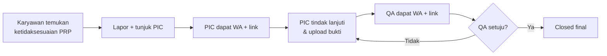

# PRD — Sistem Verifikasi PRP Plant

| | |
|---|---|
| Status | Draft v1 |
| Dokumen teknis pendamping | `implementation-plan-verifikasi-prp.md` |

---

## 1. Ringkasan

Sistem verifikasi PRP plant adalah aplikasi web internal untuk mencatat, menindaklanjuti, dan memverifikasi temuan ketidaksesuaian Prerequisite Program (PRP) di pabrik — menggantikan proses Google Form manual yang selama ini dipakai. Sistem hanya bisa diakses oleh karyawan pabrik dengan NIK terdaftar, dan melibatkan tiga kapasitas kerja: **Pelapor** (siapa pun yang menemukan temuan), **PIC** (siapa pun yang ditunjuk Pelapor untuk menindaklanjuti temuan tertentu), dan **QA** (memverifikasi penyelesaian & mengelola data master).

---

## 2. Latar belakang & masalah

Proses pelaporan PRP saat ini memakai Google Form, dengan masalah:
- Tidak ada status yang jelas — laporan hanya numpuk di spreadsheet tanpa alur tindak lanjut.
- Tidak ada notifikasi otomatis ke siapa pun yang harus menindaklanjuti.
- Tidak ada verifikasi berjenjang — tidak jelas apakah temuan benar-benar sudah diselesaikan dengan baik atau cuma diklaim selesai.
- Rekap dan analisis tren (misalnya temuan per departemen) harus dikerjakan manual.
- Tidak ada kontrol identitas — siapa pun yang punya link Gform bisa mengisi tanpa verifikasi.

---

## 3. Tujuan produk

- Memastikan setiap temuan PRP punya penanggung jawab yang jelas sejak awal dilaporkan.
- Mempercepat waktu respons terhadap temuan lewat notifikasi WhatsApp langsung ke orang yang tepat.
- Menjamin kualitas penyelesaian lewat verifikasi berjenjang oleh QA, bukan sekadar self-report PIC.
- Menyediakan data & rekap yang siap pakai untuk audit internal/eksternal (mis. ISO 22000/HACCP).
- Membatasi akses hanya untuk karyawan pabrik yang identitasnya terverifikasi (NIK).

**Metrik keberhasilan yang diusulkan** (bisa disesuaikan setelah v1 berjalan dan datanya tersedia):
- Rata-rata waktu dari status `open` ke `closed_acc` per temuan.
- Persentase temuan yang diselesaikan sebelum/sesuai due date.
- Jumlah temuan yang harus direvisi lebih dari sekali oleh QA (indikator kualitas tindak lanjut PIC).
- Adopsi: persentase temuan yang ditindaklanjuti PIC dalam 24 jam sejak notifikasi terkirim.

---

## 4. Non-goals (di luar cakupan v1)

- Aplikasi mobile native — v1 cukup web responsive.
- Integrasi ke sistem ERP/QMS pabrik.
- E-signature untuk approval QA.
- Reminder otomatis mendekati due date.
- Reassignment PIC (memindahkan penunjukan ke orang lain jika PIC awal tidak merespons).
- Channel notifikasi selain WhatsApp (mis. email) — v1 fokus WhatsApp saja.

---

## 5. Pengguna & persona

Sistem ini **tidak punya role tetap "Pelapor" atau "PIC"** — keduanya kapasitas dinamis yang bisa dimiliki bergantian oleh akun yang sama (lihat bagian 7). Hanya QA yang merupakan role akun tetap, sekaligus admin master.

| Persona | Deskripsi | Kebutuhan utama |
|---|---|---|
| Karyawan (sebagai Pelapor) | Siapa pun karyawan pabrik yang menemukan ketidaksesuaian PRP di lapangan | Cara cepat & sederhana melaporkan temuan dari HP, termasuk menunjuk siapa yang harus menindaklanjuti |
| Karyawan (sebagai PIC) | Karyawan yang ditunjuk Pelapor untuk menindaklanjuti temuan tertentu | Tahu segera kalau ditunjuk (notifikasi WA), dan bisa langsung membuka laporan yang dimaksud tanpa mencari manual |
| QA | Bertanggung jawab memverifikasi kualitas penyelesaian & mengelola data master pabrik | Visibilitas penuh atas semua temuan, alat verifikasi cepat, serta rekap/export untuk audit |

---

## 6. User stories

- Sebagai karyawan, saya ingin melaporkan temuan PRP dari HP saya di lapangan, supaya masalah langsung tercatat tanpa perlu ke komputer.
- Sebagai Pelapor, saya ingin menunjuk siapa yang bertanggung jawab menindaklanjuti temuan saya, supaya jelas tanggung jawabnya sejak awal.
- Sebagai karyawan yang ditunjuk jadi PIC, saya ingin menerima notifikasi WhatsApp dengan link langsung ke laporan, supaya saya tidak perlu login lalu mencari laporan mana yang dimaksud.
- Sebagai karyawan, saya ingin bisa berpindah antara tampilan Pelapor dan PIC dalam satu akun yang sama, supaya saya tidak perlu akun terpisah untuk dua peran ini.
- Sebagai PIC, saya ingin mencatat tindakan perbaikan dan mengunggah bukti foto, supaya penyelesaian saya terdokumentasi.
- Sebagai QA, saya ingin melihat dashboard seluruh temuan beserta statusnya, supaya saya bisa memantau apa yang masih tertunda.
- Sebagai QA, saya ingin melihat grafik temuan per departemen dan rekap per periode, supaya saya bisa mengenali pola/tren.
- Sebagai QA, saya ingin memverifikasi bukti sebelum status ditutup final, supaya kualitas penyelesaian terjaga, bukan sekadar diklaim selesai oleh PIC.
- Sebagai QA, saya ingin export data (custom range/bulanan/tahunan) dalam Excel dan PDF, supaya saya bisa melampirkannya untuk keperluan audit.
- Sebagai QA (admin master), saya ingin hanya karyawan dengan NIK terdaftar yang bisa memiliki akun, supaya sistem tidak diakses sembarang orang.

---

## 7. Requirement fungsional

| ID | Requirement |
|---|---|
| FR-1 | Login hanya bisa memakai NIK yang terdaftar & aktif di master data karyawan; tidak ada pendaftaran publik. |
| FR-2 | Setiap akun karyawan mendarat di tampilan Pelapor secara default setelah login. |
| FR-3 | Form pelaporan mencatat: tanggal temuan, nama penemu (otomatis), departemen, sub area, foto temuan, deskripsi, dan **PIC yang ditunjuk**. |
| FR-4 | PIC hanya bisa dipilih dari karyawan yang sudah memiliki akun sistem. |
| FR-5 | Begitu PIC ditunjuk, sistem mengirim notifikasi WhatsApp berisi link langsung ke laporan tersebut. |
| FR-6 | Akun yang ditunjuk sebagai PIC melihat tab/tampilan PIC berisi seluruh temuan yang ditunjukkan kepadanya, tanpa perlu berganti akun. |
| FR-7 | PIC mengisi klausul temuan, tindakan perbaikan, due date, dan mengunggah bukti foto; status berjalan `open` → `in_progress` → `closed_pending_qa`. |
| FR-8 | Setiap laporan berstatus `closed_pending_qa` memicu notifikasi WhatsApp ke QA dengan link ke laporan tersebut. |
| FR-9 | Mengeklik link notifikasi WA yang belum login akan diarahkan ke halaman login, lalu otomatis diarahkan kembali ke laporan yang dimaksud setelah login berhasil. |
| FR-10 | QA dapat menyetujui (`closed_acc`) atau menolak (kembali ke `in_progress` + catatan) hasil tindak lanjut PIC. |
| FR-11 | Keputusan QA memicu notifikasi WhatsApp ke pihak terkait (Pelapor & PIC untuk persetujuan; PIC untuk penolakan), masing-masing dengan link ke laporan. |
| FR-12 | QA memiliki dashboard berisi status semua temuan, grafik jumlah temuan per departemen, dan rekap periode (custom range/bulanan/tahunan). |
| FR-13 | QA dapat mengunduh data sesuai filter periode dalam format Excel dan PDF. |
| FR-14 | QA mengelola master data karyawan (NIK), departemen, klausul PRP, dan akun pengguna. |
| FR-15 | Karyawan yang bukan Pelapor maupun PIC dari suatu temuan tidak dapat membuka atau mengedit detail temuan tersebut. |

---

## 8. Requirement non-fungsional (ringkas)

Detail teknis lengkap ada di dokumen Implementation Plan (§10–§11). Ringkasannya:

- **Keamanan & enkripsi:** HTTPS wajib, enkripsi database & file at-rest, field sangat rahasia dienkripsi di level aplikasi, password di-hash, otorisasi level-objek (bukan cuma role).
- **Performa & ketersediaan:** target uptime 99% pada jam kerja pabrik, notifikasi WhatsApp dikirim asinkron (queue) agar tidak memperlambat pengguna.
- **Kepatuhan:** memperhatikan UU PDP karena data mencakup NIK dan data pribadi karyawan (bukan nasihat hukum — perlu dikonfirmasi ke bagian legal/compliance).

---

## 9. Alur utama (high-level)

---

## 10. Asumsi & batasan

- Karyawan yang ditunjuk sebagai PIC diasumsikan sudah punya akun sistem sebelum ditunjuk (kalau belum, QA membuatkan akunnya lebih dulu).
- QA adalah role akun tetap dan terpisah — QA tidak melalui alur Pelapor/PIC yang sama seperti karyawan biasa (asumsi, bisa direvisi kalau ternyata QA juga perlu melapor temuan sendiri).
- Nomor WhatsApp yang dipakai untuk notifikasi diasumsikan valid & aktif; belum ada mekanisme fallback (mis. email) kalau pengiriman WA gagal di v1.
- Satu temuan hanya punya satu PIC pada satu waktu; tidak ada penunjukan PIC ganda/tim di v1.

---

## 11. Rencana rilis

v1 dikerjakan sebagai rencana kerja harian selama **7 hari kerja** (lihat Implementation Plan §12 untuk breakdown tugas per hari), dengan target di akhir hari ke-7 seluruh alur inti (Pelapor → PIC → QA, termasuk notifikasi WA dengan deep link) sudah berjalan end-to-end di lingkungan staging.

---

## 12. Risiko & pertanyaan terbuka

| Risiko/pertanyaan | Catatan |
|---|---|
| PIC yang ditunjuk tidak merespons dalam waktu lama | Belum ada mekanisme reassignment di v1 — masuk roadmap lanjutan |
| Nomor WhatsApp PIC/QA salah atau sudah tidak aktif | Belum ada channel fallback (email/SMS) di v1 |
| Apakah QA juga perlu bisa jadi Pelapor/PIC? | Belum didefinisikan; asumsi saat ini: tidak, QA murni verifikator + admin master |
| Estimasi 7 hari cukup agresif | Bergantung pada seberapa efektif AI-assisted coding dipakai; kalau meleset, prioritaskan alur inti (hari 1–5) di Implementation Plan sebelum fitur pelengkap |
